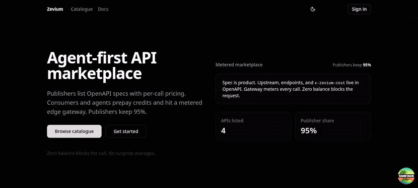
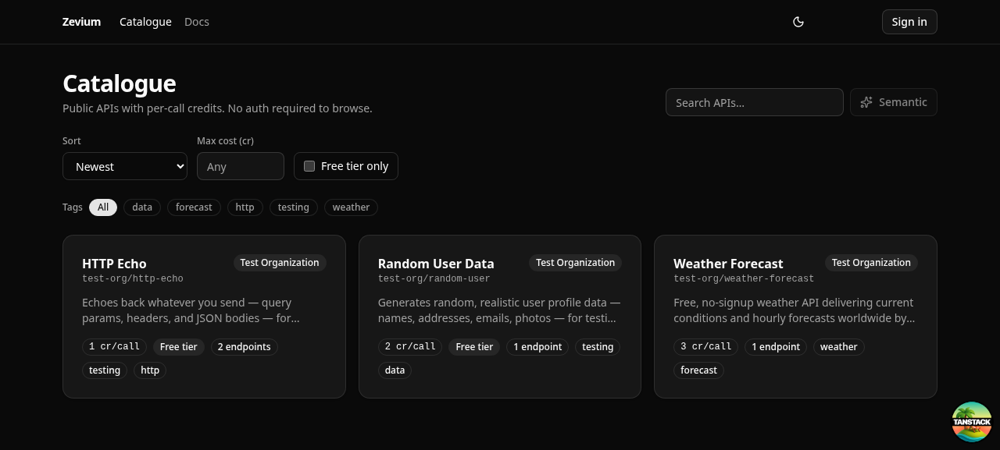
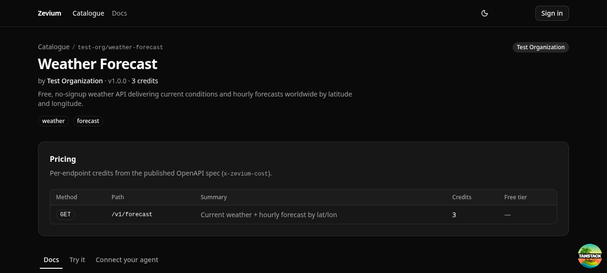
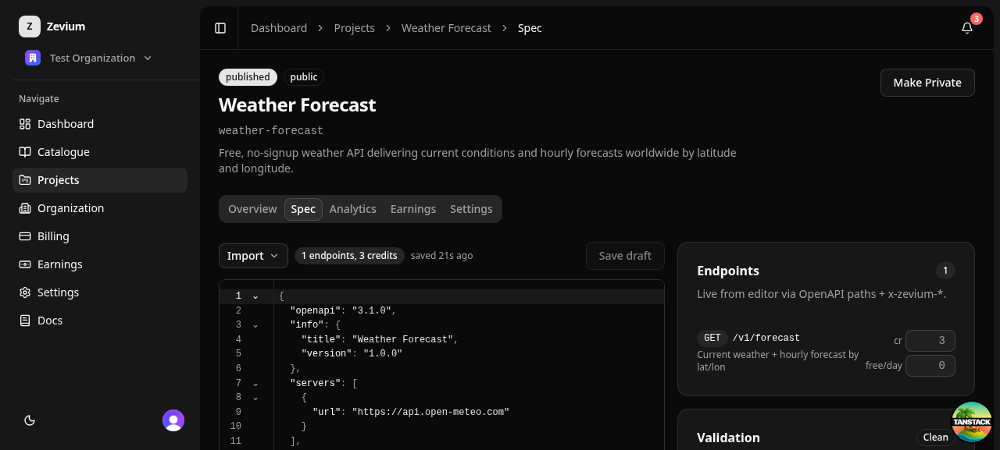
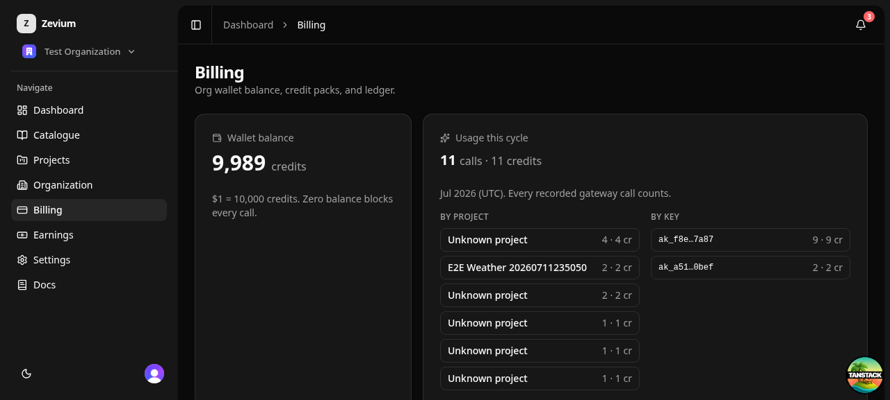

<h1> — agent-first API marketplace</h1>

Publishers list APIs as OpenAPI specs with per-call pricing baked into the spec.
Consumers — human developers and AI agents — prepay org-scoped credits and call
through a metered edge gateway. Zero balance blocks the call. Publishers keep 95%.




_Full walkthrough with the publisher console, billing, earnings, and admin:
[docs/assets/demo.mp4](docs/assets/demo.mp4)_

## How it works

1. **Publish** — upload an OpenAPI spec. Upstream URL, endpoints, and pricing
   (`x-zevium-cost`, `x-zevium-free-tier`) live in the spec. Published versions
   are immutable; pricing has no parallel tables to drift.
2. **Discover & call** — browse or semantically search the catalogue, try any
   endpoint for free via keyless mock responses, then call the real thing
   through `/gateway/{org}/{project}/{path}` with one API key. Agents get an
   MCP endpoint and a machine-readable `/discovery` index.
3. **Settle per call** — a per-org wallet (Durable Object at the edge) reserves
   credits before the proxy, settles on 2xx, refunds on failure. $1 = 10,000
   credits; the platform takes 5%, publishers accrue 95% toward payouts.

## Screenshots

|                                                                             |                                                                     |
| --------------------------------------------------------------------------- | ------------------------------------------------------------------- |
|  |  |
| _Catalogue — search, tags, price badges_                                    | _API detail — spec-driven pricing table_                            |
|           |             |
| _Spec editor — live validation + pricing rail_                              | _Billing — wallet, packs, cycle breakdown_                          |

## What's inside

- **Metered gateway** (Cloudflare Worker) — key verification with edge caching,
  per-org wallet DO (reserve → settle/refund), per-key monthly caps and
  rotation with grace, RFC 8594 deprecation headers, CORS for browser callers,
  generic payment-required action envelopes, keyless `/mock` mode, `/mcp` + `/discovery`
  for agents.
- **Control plane** (Convex) — projects and immutable spec versions, credit
  ledger, usage analytics, publisher earnings, Stripe event reconciliation,
  notifications, publisher webhooks (HMAC-signed, retried), semantic catalogue
  search (Gemini embeddings + vector index), platform admin.
- **Web app** (TanStack Start + React 19 + shadcn/ui + Motion) — public
  catalogue with try-it playground, CodeMirror spec editor with a two-way
  pricing rail and version diffs, org billing with Stripe Checkout, Connect
  publisher onboarding, earnings/transfers/payouts, in-app docs at `/docs`.
- **Auth** (Clerk) — orgs, machine API keys with org claims, prebuilt
  profile/org management embeds.

## Repo layout

```
apps/web/        # TanStack Start app — all screens
apps/gateway/    # CF Worker: metered proxy, wallet DO, mock, MCP, discovery
convex/          # Convex schema + functions (control plane)
packages/shared/ # OpenAPI parsing, x-zevium-* pricing, validation
e2e/             # agent-browser end-to-end suite (auth, publisher, consumer)
docs/            # market research + demo assets
```

Source-of-truth docs: [PRODUCT.md](PRODUCT.md) · [FLOW.md](FLOW.md) ·
[TECH.md](TECH.md) · [DESIGN.md](DESIGN.md)

Trust docs: [Security policy](SECURITY.md) ·
[Launch security and compliance posture](docs/launch-security-compliance.md)

## Development

```sh
pnpm install
npx convex dev          # control plane (needs CONVEX_DEPLOYMENT in .env.local)
pnpm dev                # web app on :3000
cd apps/gateway && npx wrangler dev --port 8787   # gateway
pnpm seed               # test user + org (test+clerk_test@zevium.dev)
```

Verification:

```sh
pnpm typecheck && pnpm test && pnpm build   # 394 unit tests across 4 suites
bash e2e/run-all.sh                         # browser e2e: auth, publish, consume
```

## License

[WTFPL](LICENSE)
